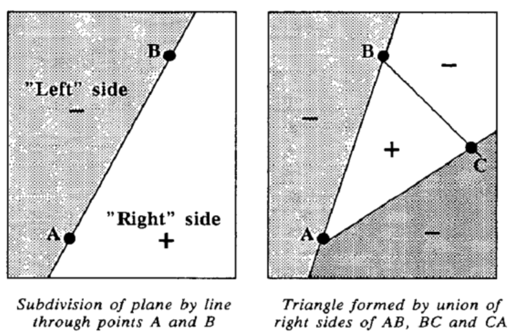
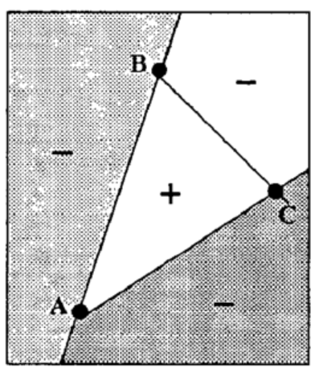
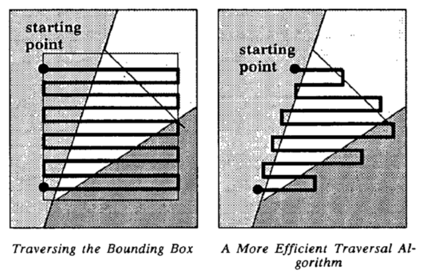
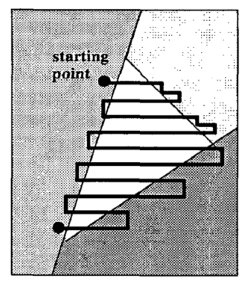
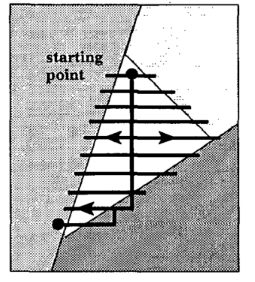
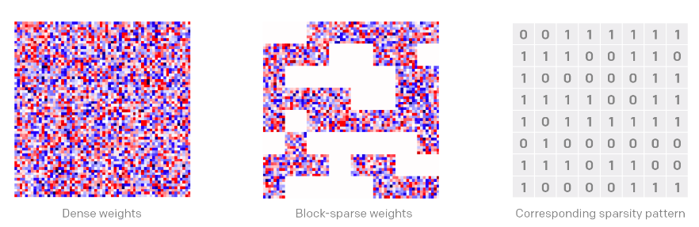

# Title

Exploring Block-Based Traversal Sampling Algorithms\\  in Polygon Rasterization

# Abstract

Rasterization is a critical process in the field of computer graphics, transforming vector descriptions into a raster format. Traditional methods often involve evaluating each individual pixel within a bounding box to determine whether it lies inside the target shape or optimizing it by using traversal algorithm. However, this approach can lead to performance losses due to the unnecessary computation of non-overlapping regions. To address this issue, this paper presents an innovative Block-Based Traversal Sampling algorithm for rasterization. This technique divides the bounding box into multiple blocks, calculating overlaps  between each block and the target 2D polygon according to Separating Axis Theorem. Only the overlapping blocks are evaluated by traversal algorithm then sampled, effectively omitting the computation for non-overlapping regions. The algorithm in this paper combines the advantages of these two methods and is further optimized by a method similar to Block Sparse algorithm. By this means, the proposed method significantly reduces computational overhead and enhances performance, thereby offering a promising alternative for efficient rasterization in computer graphics.

# Introduction

The rapid rendering of 3D Z-buffered, linearly interpolated polygons is a foundational problem in computer graphics. This problem is generally comprised of two components: 1) the three-dimensional transformation, projection, and illumination computations of the vertices, and 2) the rasterization of the polygon onto a frame buffer. This paper specifically addresses one facet of the second component, namely, the computation of the polygon's boundaries.

Traditionally, each pixel is considered a point to evaluate its positional relation with the polygon. This is achieved by conducting a cross-product operation on the edges of the polygon, which results in determining the sides of each edge the point lies on. This eventually helps us understand whether a pixel resides within a triangle.

Naturally, enhancing the performance of this algorithm during the rasterization sampling phase is crucial, especially given the significant overhead required to determine the position of each pixel within the triangle. The first significant performance-enhancing strategy was the introduction of the bounding box algorithm.

The bounding box algorithm, simply put, is a method that encapsulates a polygon within a rectangle that is large enough to contain it. By creating a bounding box, unnecessary computations are reduced, as it eliminates the need to perform calculations for pixels outside the box. This results in significant performance savings by localizing the area of interest to the bounding box alone.

Further optimization was achieved through revising the order of traversal, with the development of the Traversal Algorithm. This algorithm ensures the coverage of all pixels in a polygon. Figure 3 illustrates two basic algorithms. The simplest strategy is to traverse the bounding box; however, it is not typically the most efficient. A more intelligent algorithm would move to the next line once it goes beyond the edge of a triangle.

A significant complication of this intelligent algorithm is that when it advances to the subsequent line, it might enter the triangle. In such instances, the algorithm must first seek the edge's exterior before initiating the next scan line. An example of this issue is demonstrated on the top right-hand edge of the triangle in Figure 4.

An even smarter algorithm is illustrated in Figure 5. This algorithm descends from the starting point, gradually expanding from a center line. This algorithm's advantage over the simpler one is that it never needs to seek an edge, then backtrack. However, the tradeoff is that the interpolator state for the center line must be preserved while traversing the outer points, since the interpolators must be re-initiated back at the center line. It should be noted that at the bottom, the "center" line shifts over if it ends up exterior to the triangle.

Although the Traversal Algorithm also considers slicing for parallel optimization, it doesn't elaborate on how to select the corresponding slice. Thus, in this paper, the Block-Based Traversal Algorithm is introduced to optimize this process, taking a leaf from OpenAI's Block Sparse Algorithm.

The Block Sparse Algorithm, pioneered by OpenAI, enhances computational efficiency by concentrating the computation on blocks of the input matrix with high magnitude. It divides the matrix into several blocks, then based on a certain threshold, only processes the blocks containing significant values while skipping over those with low magnitude.

Applying a similar concept, we calculate whether each block rectangle in the bounding box overlaps with the polygon to determine whether this block should be selected for Traversal Algorithm calculations. The overlap between two polygons can be determined by checking if any edge of each block rectangle intersects with any edge of the target polygon. If they intersect, then the block undeniably overlaps with the polygon.

Therefore, the flow of this algorithm involves determining the bounding box, dividing the bounding box according to the block size, and then generating a block mask Boolean matrix by judging whether each block overlaps. Following this, the Traversal Algorithm is applied in parallel to each bounding box, producing the final sampling results.